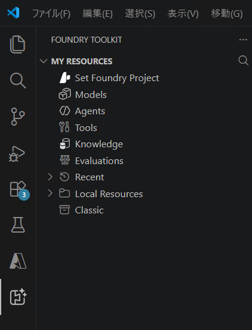
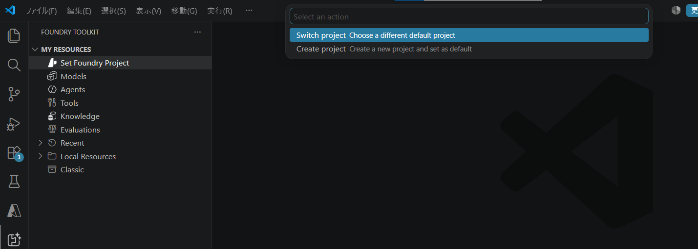
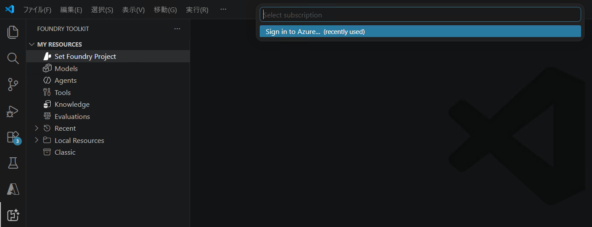
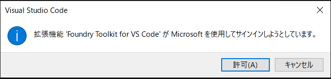
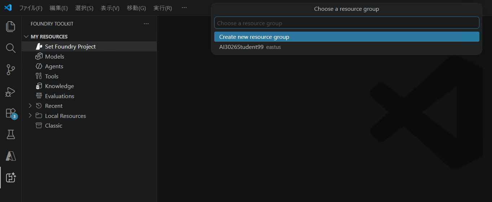
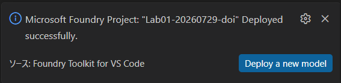
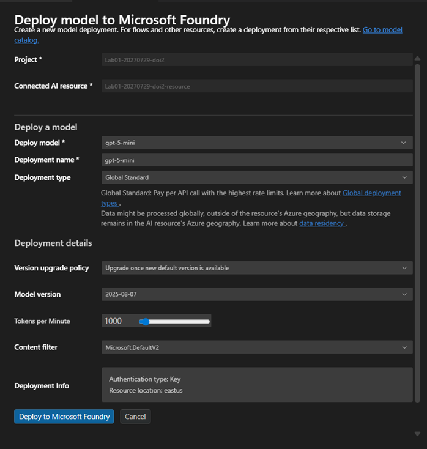
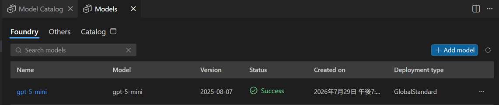
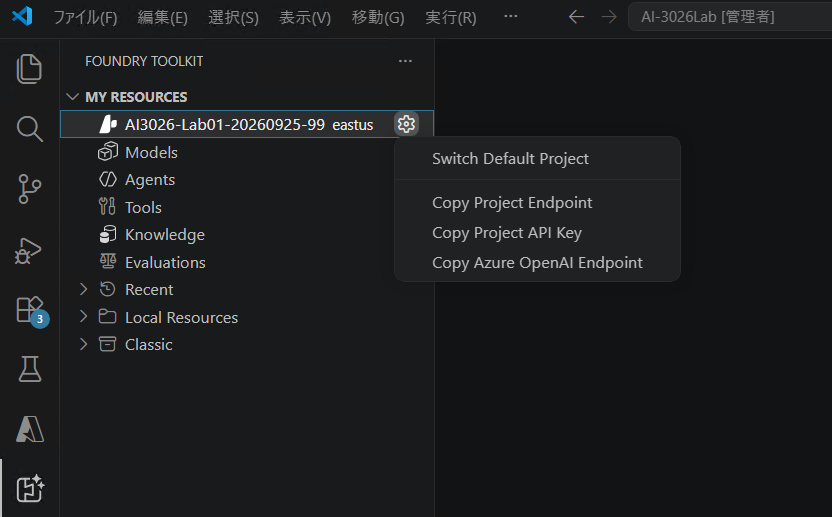

---
lab:
    title: 'AI エージェントでのカスタム関数の使用'
    description: '関数を使用してエージェントにカスタム機能を追加する方法を学ぶ。'
    level: 300
    duration: 50
    islab: true
    status: 'released'
---

# AI エージェントでのカスタム関数の使用

この演習では、カスタム関数をツールとして使用してタスクを実行できるエージェントを作成する方法を探ります。エージェントは天文アシスタントとして機能し、天文イベントに関する情報を提供したり、ユーザーの入力に基づいて望遠鏡レンタルのコストを計算したりします。関数ツールを定義し、エージェントが行う関数呼び出しを処理するロジックを実装します。

> **ヒント**: この演習で使用するコードは、Python 用の Microsoft Foundry SDK を基にしています。Microsoft .NET、JavaScript、Java の SDK を使用して同様のソリューションを開発することもできます。詳細については、[Microsoft Foundry SDK クライアント ライブラリ](https://learn.microsoft.com/azure/ai-foundry/how-to/develop/sdk-overview) を参照してください。

この演習の所要時間は約 **50** 分です。

> **注意**: この演習で使用する一部のテクノロジーはプレビュー中または開発中のため、予期しない動作、警告、またはエラーが発生する場合があります。

## 前提条件

この演習を開始する前に、以下を準備してください。

- ローカル コンピューターへの [Visual Studio Code](https://code.visualstudio.com/) のインストール
- アクティブな [Azure サブスクリプション](https://azure.microsoft.com/free/)
- [Python 3.13](https://www.python.org/downloads/) 以降のインストール

> \* Python 3.13 は利用可能ですが、一部の依存関係はまだそのリリース向けにコンパイルされていません。このラボは `Python 3.13.12` で正常にテスト済みです。

## VS Code 用 Foundry Toolkit 拡張機能での Foundry プロジェクトの作成

開発者として Foundry ポータルで作業する場合もありますが、Visual Studio Code での作業時間も長くなります。VS Code 用 Foundry Toolkit 拡張機能を使用すると、開発環境を離れることなく Foundry プロジェクト リソースを操作できます。

> **注意**: Foundry Toolkit 拡張機能は演習環境にインストール済みです。拡張機能のインストール作業は不要です。一部の UI では **AI Toolkit** と表示される場合がありますが、同じ拡張機能です。

> **重要**: ここで作成する Foundry プロジェクトと gpt-5-mini モデルは、**この後の演習 02・04・05 でも継続して使用します**。演習がすべて終わるまで削除しないでください。後続の演習（特に演習 05 のマルチエージェント構成）でレート制限により応答が出力されなくなることを避けるため、TPM は既定値ではなく **5K** で作成します。

1. Visual Studio Code を開きます。

1. サイドバーの Foundry Toolkit アイコンを選択します。

    **FOUNDRY TOOLKIT** ペインが開き、**[MY RESOURCES]** の下に **[Set Foundry Project]** が表示されます。

    

1. **[MY RESOURCES]** の下で **[Set Foundry Project]** を選択し、画面上部に表示されたメニューで **[Create project]** を選択します。

    

    既定のプロジェクトがすでに設定されている場合は、**[Set Foundry Project]** の代わりにプロジェクト名が **[MY RESOURCES]** の下に表示されます。プロジェクト名の横にある歯車アイコンを選択して **[Switch Default Project]** を選択し、表示されたメニューで **[Create project]** を選択します。

1. **[Select subscription]** で Azure サブスクリプションを選択します。

    まだ Azure にサインインしていない場合は、**[Sign in to Azure...]** を選択します。

    

    「拡張機能 'Foundry Toolkit for VS Code' が Microsoft を使用してサインインしようとしています」というダイアログが表示されたら **[許可]** を選択し、ブラウザーで Azure アカウントにサインインします。サインイン後、VS Code に戻ってサブスクリプションを選択します。

    

1. **[Choose a resource group]** で、各自に割り当てられた既存のリソース グループ（**AI3026StudentXX**）を選択します。**[Create new resource group]** は選択しないでください。

    

1. Foundry プロジェクトの名前を入力して、この演習用の新しいプロジェクトを作成します。**（プロジェクト名の例：AI3026-Lab01-20260806-XX、XXは各自配布されたアカウントの連番）** 

    デプロイが完了すると、プロジェクトが Foundry Toolkit ペインに既定のプロジェクトとして表示されます。

## モデルのデプロイ

生成 AI プロジェクトの中核には、少なくとも 1 つの生成 AI モデルがあります。このタスクでは、エージェントで使用するモデルをモデル カタログからデプロイします。

1. 「プロジェクトが正常にデプロイされました」というポップアップが表示されたら、**[新しいモデルのデプロイ]** ボタンを選択します。モデル カタログが開きます。

    > **ヒント**: **[MY RESOURCES]** の **[Models]** の横にある **[+]** アイコンを選択するか、**F1** キーを押して **[Foundry Toolkit: Show model catalog]** コマンドを実行してモデル カタログにアクセスすることもできます。

    

1. モデル カタログで **gpt-5-mini** モデルを見つけます（検索バーを使用すると素早く見つけられます）。

1. gpt-5-mini モデルの横にある **[デプロイ]** を選択します。

1. デプロイ設定を構成します。
    - **デプロイ名**: `gpt-5-mini` （既定のまま） 
    - **デプロイの種類**: **[グローバル標準]** を選択（グローバル標準が利用できない場合は **[標準]**）
    - **モデル バージョン**: 既定のまま
    - **1 分あたりのトークン数**: **5K（5000）** に設定します（既定値は 1000 ですが、後続の演習（特に演習 05 のマルチエージェント構成）で応答が出力されないことがあるため、ここで 5000 に引き上げます）

    > **ヒント**: グローバル標準はより広いリージョンにわたってリソースを分散するため、より高いスループットを提供します。リージョンの制約で利用できない場合は標準を選択してください。

    

1. 左下隅の **[Microsoft Foundry にデプロイ]** を選択します。

1. デプロイが完了するまで待ちます。デプロイされたモデルがリソース ビューの **[モデル]** セクションに表示されます。

    

1. Foundry Toolkit のサイドバーで、**[MY RESOURCES]** の下に作成したプロジェクト（例: `AI3026-Lab01-20260806-XX`）が表示され、その下に **Models**・**Agents**・**Tools**・**Knowledge**・**Evaluations** などが表示されていることを確認します。

    

1. **[MY RESOURCES]** の下のプロジェクト名の横にある歯車アイコンを選択し、**[Copy Project Endpoint]** を選択します。次の手順でエージェントを Foundry プロジェクトに接続するためにこの URL が必要です。

    

## スターター コードを開く

この演習では、Foundry プロジェクトに接続してカスタム関数ツールを使用するエージェントを作成するためのスターター コードを使用します。

1. VS Code で **[ファイル] > [フォルダーを開く]** を選択し、配置済みの `Labfiles/01-agent-custom-tools` フォルダーを開きます。

1. エクスプローラー ペインで **Python** フォルダーを展開して、この演習のコード ファイルを表示します。

1. **requirements.txt** ファイルを右クリックし、**[統合ターミナルで開く]** を選択します。

1. ターミナルで次のコマンドを入力して、仮想環境に必要な Python パッケージをインストールします。

    ```
    python -m venv labenv
    .\labenv\Scripts\Activate.ps1
    pip install -r requirements.txt
    ```

1. `.env` ファイルを開き、`your_project_endpoint` プレースホルダーをプロジェクトのエンドポイント（Foundry Toolkit の **[Copy Project Endpoint]** でコピーしたもの）に置き換え、MODEL_DEPLOYMENT_NAME 変数がモデルのデプロイ名に設定されていることを確認します。変更後に **Ctrl+S** キーを押してファイルを保存します。

カスタム関数をツールとして使用する AI エージェントを作成する準備ができました。

## エージェントが使用する関数の作成

1. **functions.py** ファイルを開き、既存のコードを確認します。

    このファイルには、エージェントのツールとして使用できる複数の関数が含まれています。関数は **data** フォルダー内のサンプル ファイルを使用して、天文イベントと観測地点に関する情報を取得します。

1. コメント **指定された場所で次に見える天文イベントを特定** を見つけて、以下のコードを追加します。

    ```python
    # 指定された場所で次に見える天文イベントを特定
    def next_visible_event(location: str) -> str:
       """Returns the next visible astronomical event for a location."""
       today = int(datetime.now().strftime("%m%d"))
       loc = location.lower().replace(" ", "_")

       # 今年以降のイベントから始まり、場所から見える次のイベントを取得
       for name, event_type, date, date_str, locs in EVENTS:
           if loc in locs and date >= today:
               return json.dumps({"event": name, "type": event_type, "date": date_str, "visible_from": sorted(locs)})

       return json.dumps({"message": f"No upcoming events found for {location}."})
    ```

    この関数は、指定された場所から見える次の天文イベントをサンプル イベント データから検索し、イベントの詳細を JSON 文字列として返します。次に、この関数を使用できるエージェントを作成します。

## Foundry プロジェクトへの接続

1. **agent.py** ファイルを開きます。

    > **ヒント**: コードを追加するときは、正しいインデントを維持してください。コメントのインデント レベルを参考にしてください。

1. コメント **参照の追加** を見つけて、関数ツールを使用する Azure AI エージェントを構築するために必要なクラスをインポートする以下のコードを追加します。

    ```python
    # 参照の追加
    from azure.ai.projects import AIProjectClient
    from azure.ai.projects.models import FunctionTool
    from azure.identity import DefaultAzureCredential
    from azure.ai.projects.models import PromptAgentDefinition, FunctionTool
    from openai.types.responses.response_input_param import FunctionCallOutput, ResponseInputParam
    from functions import next_visible_event, calculate_observation_cost, generate_observation_report
    ```

    **functions.py** ファイルで定義した関数がインポートされ、エージェントのツールとして使用できることに注目してください。

1. コメント **プロジェクト クライアントに接続** を見つけて、以下のコードを追加します。

    ```python
    # プロジェクト クライアントに接続
    with (
        DefaultAzureCredential() as credential,
        AIProjectClient(endpoint=project_endpoint, credential=credential) as project_client,
        project_client.get_openai_client() as openai_client,
    ):
    ```

## 関数ツールの定義

このタスクでは、エージェントが使用できる各関数ツールを定義します。各関数ツールのパラメーターは JSON スキーマを使用して定義され、関数の各パラメーターの名前、型、説明などの属性を指定します。

1. コメント **イベント関数ツールを定義** を見つけて、以下のコードを追加します。

    ```python
    # イベント関数ツールを定義
    event_tool = FunctionTool(
        name="next_visible_event",
        description="Get the next visible event in a given location.",
        parameters={
            "type": "object",
            "properties": {
                "location": {
                    "type": "string",
                    "description": "continent to find the next visible event in (e.g. 'north_america', 'south_america', 'australia')",
                },
            },
            "required": ["location"],
            "additionalProperties": False,
        },
        strict=True,
    )
    ```

1. コメント **観測コスト計算関数ツールを定義** を見つけて、以下のコードを追加します。

    ```python
    # 観測コスト計算関数ツールを定義
    cost_tool = FunctionTool(
        name="calculate_observation_cost",
        description="Calculate the cost of an observation based on the telescope tier, number of hours, and priority level.",
        parameters={
            "type": "object",
            "properties": {
                "telescope_tier": {
                    "type": "string",
                    "description": "the tier of the telescope (e.g. 'standard', 'advanced', 'premium')",
                },
                "hours": {
                    "type": "number",
                    "description": "the number of hours for the observation",
                },
                "priority": {
                    "type": "string",
                    "description": "the priority level of the observation (e.g. 'low', 'normal', 'high')",
                },
            },
            "required": ["telescope_tier", "hours", "priority"],
            "additionalProperties": False,
        },
        strict=True,
    )
    ```

1. コメント **観測レポート生成関数ツールを定義** を見つけて、以下のコードを追加します。

    ```python
    # 観測レポート生成関数ツールを定義
    report_tool = FunctionTool(
        name="generate_observation_report",
        description="Generate a report summarizing an astronomical observation",
        parameters={
            "type": "object",
            "properties": {
                "event_name": {
                    "type": "string",
                    "description": "the name of the astronomical event being observed",
                },
                "location": {
                    "type": "string",
                    "description": "the location of the observer",
                },
                "telescope_tier": {
                    "type": "string",
                    "description": "the tier of the telescope used for the observation (e.g. 'standard', 'advanced', 'premium')",
                },
                "hours": {
                    "type": "number",
                    "description": "the number of hours the telescope was used for the observation",
                },
                "priority": {
                    "type": "string",
                    "description": "the priority level of the observation (e.g. 'low', 'normal', 'high')",
                },
                "observer_name": {
                    "type": "string",
                    "description": "the name of the person who conducted the observation",
                },                   
            },
            "required": ["event_name", "location", "telescope_tier", "hours", "priority", "observer_name"],
            "additionalProperties": False,
        },
        strict=True,
    )
    ```

## 関数ツールを使用するエージェントの作成

関数ツールを定義したので、それらのツールを使用してタスクを実行できるエージェントを作成できます。

1. コメント **関数ツールを使用して新しいエージェントを作成** を見つけて、以下のコードを追加します。

    ```python
    # 関数ツールを使用して新しいエージェントを作成
    agent = project_client.agents.create_version(
        agent_name="astronomy-agent",
        definition=PromptAgentDefinition(
            model=model_deployment,
            instructions=
                """You are an astronomy observations assistant that helps users find 
                information about astronomical events and calculate telescope rental costs. 
                Use the available tools to assist users with their inquiries.""",
            tools=[event_tool, cost_tool, report_tool],
        ),
    )
    ```

## エージェントへのメッセージ送信と応答の処理

エージェントに関数ツールを使用するよう設定したので、エージェントにメッセージを送信してその応答を処理できます。

1. コメント **チャット セッション用のスレッドを作成** を見つけて、以下のコードを追加します。

    ```python
    # チャット セッション用のスレッドを作成
    conversation = openai_client.conversations.create()
    ```

    このコードはエージェントとのチャット セッションを作成します。

1. コメント **エージェントに送り返す関数呼び出し出力のリストを作成** を見つけて、以下のコードを追加します。

    ```python
    # エージェントに送り返す関数呼び出し出力のリストを作成
    input_list: ResponseInputParam = []
    ```

1. コメント **エージェントにプロンプトを送信** を見つけて、以下のコードを追加します。

    ```python
    # エージェントにプロンプトを送信
    openai_client.conversations.items.create(
        conversation_id=conversation.id,
        items=[{"type": "message", "role": "user", "content": user_input}],
    )
    ```

1. コメント **エージェントの応答を取得（関数呼び出しが含まれる場合あり）** を見つけて、以下のコードを追加します。

    ```python
    # エージェントの応答を取得（関数呼び出しが含まれる場合あり）
    response = openai_client.responses.create(
        conversation=conversation.id,
        extra_body={"agent_reference": {"name": agent.name, "type": "agent_reference"}},
        input=input_list,
    )

    # 実行ステータスのエラーを確認
    if response.status == "failed":
        print(f"Response failed: {response.error}")
    ```

    このコードでは、ユーザーのプロンプトをエージェントに送信して応答を取得します。また、応答が失敗を示す場合はエラーを確認して出力します。

## 関数呼び出しの処理とエージェント応答の表示

1. コメント **関数呼び出しを処理** を見つけて、エージェントが行う関数呼び出しを処理する以下のコードを追加します。

    ```python
    # 関数呼び出しを処理
    for item in response.output:
        if item.type == "function_call":
            # Retrieve the matching function tool
            function_name = item.name
            result = None
            if item.name == "next_visible_event":
                result = next_visible_event(**json.loads(item.arguments))
            elif item.name == "calculate_observation_cost":
                result = calculate_observation_cost(**json.loads(item.arguments))
            elif item.name == "generate_observation_report":
                result = generate_observation_report(**json.loads(item.arguments))
                 
            # 出力テキストを追加
            input_list.append(
                FunctionCallOutput(
                    type="function_call_output",
                    call_id=item.call_id,
                    output=result,
                )
            )
    ```

    このコードはエージェントの応答内のアイテムを繰り返し処理して関数呼び出しを確認します。関数呼び出しが見つかった場合は、対応する関数ツールを取得し、提供された引数で関数を実行し、結果をエージェントに送り返す入力リストに追加します。

1. コメント **関数呼び出しの出力をモデルに返して応答を取得** を見つけて、以下のコードを追加します。

    ```python
    # 関数呼び出しの出力をモデルに返して応答を取得
    if input_list:
        response = openai_client.responses.create(
            input=input_list,
            previous_response_id=response.id,
            extra_body={"agent_reference": {"name": agent.name, "type": "agent_reference"}},
        )
    # エージェントの応答を表示
    print(f"AGENT: {response.output_text}")
    ```

    このコードは入力リストに関数呼び出しの出力があるかどうかを確認し、ある場合はそれをエージェントへの入力として送り返して更新された応答を取得します。最後にエージェントの応答を出力します。

1. コメント **完了後にエージェントを削除** を見つけて、以下のコードを追加します。

    ```python
    # 完了後にエージェントを削除
    project_client.agents.delete_version(agent_name=agent.name, agent_version=agent.version)
    print("Deleted agent.")
    ```

1. ファイルに追加した完全なコードを確認します。以下のセクションが含まれているはずです。
    - 必要なライブラリのインポート
    - Foundry プロジェクトと OpenAI クライアントへの接続
    - エージェントが使用する関数ツールの定義
    - それらの関数ツールを使用するエージェントの作成
    - エージェントへのメッセージ送信と応答の取得
    - エージェントが行う関数呼び出しの処理と出力のエージェントへの送り返し
    - エージェントの応答の表示
    - 完了時のエージェントの削除

1. 完了したらコード ファイルを保存します（**Ctrl+S**）。

## エージェント アプリケーションの実行

1. 統合ターミナルで次のコマンドを入力してアプリケーションを実行します。

    ```
    az login
    ```

1. プロンプトが表示されたら、Azure サブスクリプションにサインインまたは選択します。「職場または学校アカウント」を選択してサインインしてください。次に、Visual Studio Code に戻り、サインインプロセスが完了するのを待ちます。
    コンソール上に、「Select a subscription and tenant (Type a number or Enter for no changes):」のようなメッセージが表示された場合は、「1」を入力してください。
     > サインインのウィンドウはVisual Studio Codeウィンドウの裏側に表示されるので注意してください。
    ```
    python agent.py
    ```

1. プロンプトが表示されたら、次のようなプロンプトを入力します。

    ```
    南米から見える次の天文イベントを教えてください。また、通常優先度でプレミアム望遠鏡を 5 時間使用した場合のコストも教えてください。
    ```

    このプロンプトは定義した両方の関数ツール `next_visible_event` と `calculate_observation_cost` を使用するようエージェントに求めていることに注目してください。エージェントは同じ会話ターンで両方の関数を呼び出し、それらの関数呼び出しの出力を使用してユーザーへの有用な応答を提供できます。

    > **ヒント**: レート制限を超えてアプリが失敗した場合は、数秒待ってから再試行してください。サブスクリプションで使用可能なクォータが不足している場合、モデルが応答できないことがあります。

    次のような出力が表示されます。

    ```output
    AGENT: 南米から観測できる次の天文イベントは Jupiter-Venus Conjunction で、5月1日に起こります。
    通常優先度のプレミアム望遠鏡 5 時間の観測コストは $1,875 です。
    ```

1. 観測レポートを生成するためのフォローアップ プロンプトを入力します。

    ```
    その情報を Bellows College 向けのレポートとしてまとめてください。
    ```

    次のような応答が表示されます。

    ```output
    AGENT: Bellows College 向けレポートです:

    - 次の観測可能な天文イベント: Jupiter-Venus Conjunction
    - 日付: 5月1日
    - 観測可能な場所: South America
    - 観測詳細:
        - 望遠鏡ランク: Premium
        - 時間: 5 時間
        - 優先度: Normal
    - 観測コスト: $1,875

    Bellows College 向けの正式レポートが生成されました。
    ```

    ファイル エクスプローラーで、生成されたレポートを含む `report-<event-type>.txt` という名前の新しいファイルが作成されていることを確認できます。このファイルを開いてレポートの内容を表示できます。

1. `quit` と入力してアプリケーションを終了します。

    ターミナルで `deactivate` を使用して Python 仮想環境を終了することもできます。

## クリーンアップ

この演習で使用した Foundry プロジェクトとモデルは、**後続の演習（02・04・05）でも使用します。まだ削除しないでください**。

すべての演習が完了したら、[演習 05](05-agent-framework-multi-agents.md) の「クリーンアップ」に従ってリソースを削除してください。

