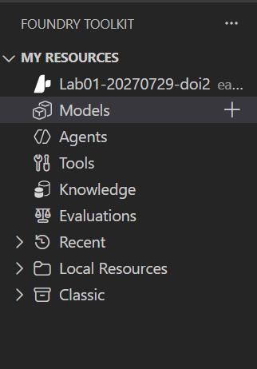

---
lab:
    title: 'リモート MCP サーバーによるエージェントの拡張'
    description: 'リモートの Model Context Protocol (MCP) サーバー ツールに接続し、エージェントの機能を拡張する。'
    level: 300
    duration: 25
    islab: true
    status: 'released'
---

# リモート MCP サーバーによるエージェントの拡張

この演習では、VS Code 用 Foundry Toolkit 拡張機能を使用して、Model Context Protocol (MCP) サーバー ツールを介して外部データ ソースや API にアクセスできるエージェントを作成します。エージェントは MCP ツールを通じて最新情報を取得できるようになります。

この演習の所要時間は約 **25** 分です。

> **注意**: この演習で使用する一部のテクノロジーはプレビュー中または開発中のため、予期しない動作、警告、またはエラーが発生する場合があります。

## 前提条件

この演習を開始する前に、以下を準備してください。

- ローカル コンピューターへの [Visual Studio Code](https://code.visualstudio.com/) のインストール
- アクティブな [Azure サブスクリプション](https://azure.microsoft.com/free/)
- [Python 3.13](https://www.python.org/downloads/) 以降のインストール
- [演習 01](01-agent-custom-tools.md) の完了（Foundry プロジェクトと gpt-5-mini モデルをこの演習でも使用します）

> \* Python 3.13 は利用可能ですが、一部の依存関係はまだそのリリース向けにコンパイルされていません。このラボは `Python 3.13.12` で正常にテスト済みです。

## Foundry プロジェクトとモデルの確認

この演習では、**演習 01 で作成した Foundry プロジェクトと gpt-5-mini モデルをそのまま使用します**。新しく作成する必要はありません。

1. Visual Studio Code のサイドバーで **Foundry Toolkit** アイコンを選択します。
1. **[MY RESOURCES]** の下に、演習 01 で作成したプロジェクトが表示されていることを確認します。プロジェクトの配下には **Models**・**Agents**・**Tools**・**Knowledge**・**Evaluations** のツリーが表示されます。

    

1. **Models** を展開し、`gpt-5-mini` のデプロイが **Success** になっていることを確認します。
1. プロジェクト デプロイの名前を右クリックし、**[プロジェクト エンドポイントのコピー]** を選択します。この URL を次の手順で `.env` に設定します。

> **注意**: 演習 01 を実施していない場合は、先に [演習 01](01-agent-custom-tools.md) の「Foundry プロジェクトの作成」「モデルのデプロイ」を完了してください。

## スターター コードを開く

この演習では、Foundry プロジェクトに接続してリモート MCP サーバー ツールを使用するエージェントを作成するためのスターター コードを使用します。

1. VS Code で **[ファイル] > [フォルダーを開く]** を選択し、配置済みの `Labfiles/02-mcp-integration` フォルダーを開きます。

1. エクスプローラー ペインで **Python** フォルダーを展開して、この演習のコード ファイルを表示します。

1. **requirements.txt** ファイルを右クリックし、**[統合ターミナルで開く]** を選択します。

1. ターミナルで次のコマンドを入力して、演習用にあらかじめ構築済みの仮想環境 (`labenv`) を有効化します。

    ```
    .\labenv\Scripts\Activate.ps1
    ```

    > **注意**: 必要な Python パッケージは `labenv` に事前インストール済みです。`pip install` を再実行する必要はありません。

1. `.env` ファイルを開き、`your_project_endpoint` プレースホルダーをプロジェクトのエンドポイント（Foundry Toolkit 拡張機能のプロジェクト デプロイ リソースからコピーしたもの）に置き換え、MODEL_DEPLOYMENT_NAME 変数がモデルのデプロイ名に設定されていることを確認します。変更後に **Ctrl+S** キーを押してファイルを保存します。

リモート MCP サーバーに接続する AI エージェントを作成する準備ができました。

## リモート MCP サーバーへの Azure AI エージェントの接続

このタスクでは、リモート MCP サーバーに接続し、AI エージェントを準備してユーザーのプロンプトを実行します。

1. コード エディターで **agent.py** ファイルを開きます。

    > **ヒント**: コードを追加するときは、正しいインデントを維持してください。コメントのインデント レベルを参考にしてください。

1. コメント **参照の追加** を見つけて、クラスをインポートする以下のコードを追加します。

    ```python
    # 参照の追加
    from azure.identity import DefaultAzureCredential
    from azure.ai.projects import AIProjectClient
    from azure.ai.projects.models import PromptAgentDefinition, MCPTool, Reasoning
    from openai.types.responses.response_input_param import McpApprovalResponse, ResponseInputParam
    ```

1. コメント **エージェント クライアントに接続** を見つけて、現在の Azure 資格情報を使用して Azure AI プロジェクトに接続する以下のコードを追加します。

    ```python
    # エージェント クライアントに接続
    with (
        DefaultAzureCredential() as credential,
        AIProjectClient(endpoint=project_endpoint, credential=credential) as project_client,
        project_client.get_openai_client() as openai_client,
    ):
    ```

1. コメント **エージェント MCP ツールを初期化** の下に以下のコードを追加します。

    ```python
    # エージェント MCP ツールを初期化
    mcp_tool = MCPTool(
        server_label="api-specs",
        server_url="https://learn.microsoft.com/api/mcp",
        require_approval="always",
    )
    ```

    このコードは Microsoft Learn Docs のリモート MCP サーバーに接続します。これはクラウドでホストされるサービスで、クライアントが Microsoft の公式ドキュメントから信頼性の高い最新情報に直接アクセスできるようにします。

1. コメント **MCP ツールを使用して新しいエージェントを作成** の下に以下のコードを追加します。

    ```python
    # MCP ツールを使用して新しいエージェントを作成
    agent = project_client.agents.create_version(
        agent_name="MyAgent",
        definition=PromptAgentDefinition(
            model=model_deployment,
            instructions="あなたは MCP ツールを使用してユーザーを支援するエージェントです。利用可能な MCP ツールを使用して質問に答え、タスクを実行してください。",
            tools=[mcp_tool],
            reasoning=Reasoning(effort="low"),
        ),
    )
    print(f"Agent created (id: {agent.id}, name: {agent.name}, version: {agent.version})")
    ```

    このコードではエージェントへの手順を提供し、MCP ツール定義を渡します。

    > **注意**: gpt-5-mini は reasoning（推論）モデルであり、可視の回答テキストとは別に内部で reasoning トークンを消費します。`reasoning=Reasoning(effort="low")` を指定しないと、reasoning にトークン予算を使い切ってしまい `Agent response:` が空文字列になることがあります。この設定であれば TPM（1 分あたりのトークン数）クォータが 1000 のままでも安定して動作することを確認済みです。なお `responses.create()` 側に `reasoning` や `max_output_tokens` を直接渡すと、`agent_reference` 指定時は `"Not allowed when agent is specified"` エラーになるため、必ずエージェント定義（`PromptAgentDefinition`）側で指定してください。※ 演習 05（マルチエージェント）では複数エージェントが順に応答するため、TPM を 5K に引き上げる必要があります。

1. コメント **会話スレッドを作成** を見つけて以下のコードを追加します。

    ```python
    # 会話スレッドを作成
    conversation = openai_client.conversations.create()
    print(f"Created conversation (id: {conversation.id})")
    ```

1. コメント **MCP ツールをトリガーする初回リクエストを送信** を見つけて以下のコードを追加します。

    ```python
    # MCP ツールをトリガーする初回リクエストを送信
    response = openai_client.responses.create(
        conversation=conversation.id,
        input="Give me the Azure CLI commands to create an Azure Container App with a managed identity.",
        extra_body={"agent_reference": {"name": agent.name, "type": "agent_reference"}},
    )
    ```

1. コメント **MCP 承認リクエストが無くなるまでラウンドを繰り返す** を見つけて以下のコードを追加します。MCP サーバーとのやり取りは複数ラウンドの承認になることがあるため、承認リクエストが無くなるまで繰り返す `while` ループにします（内部に元の **生成された MCP 承認リクエストを処理** / **承認応答を返して応答を取得** の処理がインライン コメント付きで含まれます）。

    ```python
    # MCP 承認リクエストが無くなるまでラウンドを繰り返す
    while True:
        # 生成された MCP 承認リクエストを処理
        input_list: ResponseInputParam = []
        for item in response.output:
            if item.type == "mcp_approval_request":
                if item.server_label == "api-specs" and item.id:
                    # エージェントが続行できるよう MCP リクエストを自動承認
                    input_list.append(
                        McpApprovalResponse(
                            type="mcp_approval_response",
                            approve=True,
                            approval_request_id=item.id,
                        )
                    )

        if not input_list:
            break

        # 承認応答を返して応答を取得
        response = openai_client.responses.create(
            input=input_list,
            previous_response_id=response.id,
            extra_body={"agent_reference": {"name": agent.name, "type": "agent_reference"}},
        )

    print(f"\nAgent response: {response.output_text}")
    ```

    このコードはエージェントの応答内の MCP 承認リクエストを受け取り自動的に承認し、それ以上承認リクエストが無くなるまで（＝最終的な回答テキストが得られるまで）このやり取りを繰り返します。

1. コメント **エージェント バージョンを削除してリソースをクリーンアップ** を見つけて以下のコードを追加します。

    ```python
    # エージェント バージョンを削除してリソースをクリーンアップ
    project_client.agents.delete_version(agent_name=agent.name, agent_version=agent.version)
    print("Agent deleted")
    ```

1. 完了したらコード ファイルを保存します（**Ctrl+S**）。

## リモート MCP サーバーへの接続のテスト

アプリケーションを実行して、エージェントが MCP ツールを使用して Microsoft Learn Docs のリモート MCP サーバーから情報を取得する様子を確認します。

1. 統合ターミナルで次のコマンドを入力してアプリケーションを実行します。

    ```
    az login
    ```

    ```
    python agent.py
    ```

1. エージェントがプロンプトを処理し、MCP サーバーを使用して要求された情報を取得するための適切なツールを見つけるまで待ちます。次のような出力が表示されます。

    ````
    Agent created (id: MyAgent:2, name: MyAgent, version: 2)
    Created conversation (id: conv_086911ecabcbc05700BBHIeNRoPSO5tKPHiXRkgHuStYzy27BS)

    Agent response: Here are Azure CLI commands to create an Azure Container App with a managed identity:

    **1. For a System-assigned Managed Identity**
    ```sh
    az containerapp create \
    --name <CONTAINERAPP_NAME> \
    --resource-group <RESOURCE_GROUP> \
    --environment <CONTAINERAPPS_ENVIRONMENT> \
    --image <CONTAINER_IMAGE> \
    --identity 'system'
    ```

    [continued...]

    Agent deleted

    ````

    エージェントが MCP ツールを自動的に呼び出してリクエストを実行できたことに注目してください。

1. リクエスト内の入力を更新して、別の情報を求めることができます。いずれの場合も、エージェントは MCP ツールを使用して技術ドキュメントを検索しようとします。

## まとめ: 演習 01 との違い

| 観点 | 01 カスタム関数 | 02a リモート MCP |
|---|---|---|
| ツールの実体 | 自分で書いた Python 関数（`functions.py`） | 他者が公開・運用するサーバー（Microsoft Learn Docs） |
| 実行される場所 | 自分のプロセス内 | リモート、HTTP 越し |
| ツールの定義 | `FunctionTool` に JSON スキーマを手書き | `MCPTool(server_url=...)` を渡すだけ／ツール一覧はサーバーが公開 |
| 呼び出しの処理 | `function_call` を受けて `if`/`elif` で自分でディスパッチ | Foundry 側が自動実行、コードに分岐は不要 |
| 承認 | なし | `require_approval="always"` → `McpApprovalResponse` で応答 |
| 追加できるツール | 自分が書いた分だけ | サーバーが公開する分すべて |

演習 01 は「関数を自分で配線する」方式でした。それに対して演習 02a は「配線済みのツール群に接続する」方式です。MCP はツールの**発見**と**呼び出し規約**を標準化したものであり、その代わりに承認フローという新しい関心事が加わります。

## 次の演習へ

ここまでは他社が公開する MCP サーバーに**接続する**側でした。次の [演習 02b](02b-mcp-custom-server.md) では、自分で MCP サーバーを**作る**側に回り、独自のツールをエージェントに公開します。

## クリーンアップ

この演習で使用した Foundry プロジェクトとモデルは、**後続の演習（02b・04・05）でも使用します。まだ削除しないでください**。

すべての演習が完了したら、[演習 05](05-agent-framework-multi-agents.md) の「クリーンアップ」に従ってリソースを削除してください。
