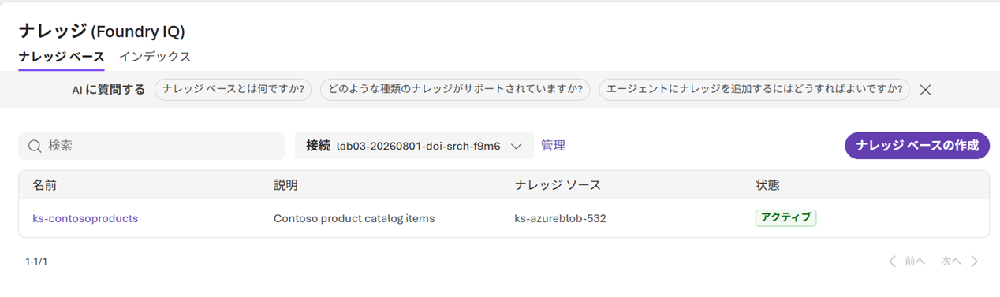

---
lab:
    title: 'AI エージェントと Foundry IQ の統合'
    description: 'Azure AI Agent Service を使用して、Foundry IQ でナレッジ ベースを検索するエージェントを開発する。'
    level: 300
    duration: 45
    islab: true
    status: 'released'
---

# AI エージェントと Foundry IQ の統合

この演習では、Microsoft Foundry ポータルを使用して、Foundry IQ と統合してナレッジ ベースから情報を検索・取得するエージェントを作成します。検索リソースを作成し、サンプル データでナレッジ ベースを設定し、ポータルでエージェントを構築した後、Visual Studio Code から接続してプログラムで対話します。

> **ヒント**: この演習で使用するコードは、Python 用の Microsoft Foundry SDK を基にしています。Microsoft .NET、JavaScript、Java の SDK を使用して同様のソリューションを開発することもできます。詳細については、[Microsoft Foundry SDK クライアント ライブラリ](https://learn.microsoft.com/azure/ai-foundry/how-to/develop/sdk-overview) を参照してください。

この演習の所要時間は約 **45** 分です。

> **注意**: この演習で使用する一部のテクノロジーはプレビュー中または開発中のため、予期しない動作、警告、またはエラーが発生する場合があります。

## 前提条件

この演習を開始する前に、以下を準備してください。

- AI リソースを作成する権限を持つ [Azure サブスクリプション](https://azure.microsoft.com/free/)
- ローカル コンピューターへの [Visual Studio Code](https://code.visualstudio.com/) のインストール
- [Python 3.13](https://www.python.org/downloads/) 以降のインストール
- Microsoft Foundry ポータルと Python プログラミングの基本的な知識

## Foundry プロジェクトの作成

新しい Foundry エクスペリエンスで Foundry プロジェクトを作成します。

1. Web ブラウザーで `https://ai.azure.com` の [Foundry ポータル](https://ai.azure.com) を開き、構築の開始を選びます。
Azure 資格情報を使用してサインインします。初回サインイン時に表示されるヒントやクイック スタート ペインをすべて閉じます。

    > **重要**: このラボでは更新されたユーザー インターフェイスを使用するために、**新しい Foundry** トグルが*オン*になっていることを確認してください。

1. **[プロジェクトの作成]** を選択します。
1. **[プロジェクトの作成]** ダイアログで、各項目を入力します。
1. プロジェクトの以下の設定を確認または構成します。
    - **プロジェクト名**: *変更なし（自動で入力されたプロジェクト名を使用）*
    - **Foundry リソース**: *変更なし（プロジェクト名を変更すると、自動で入力されます）*
    - **サブスクリプション**: *従量課金*
    - **リソース グループ**: *変更なし（AI3026StudentXX）*
    - **リージョン**: *East US* \*

    > 一部の Azure AI リソースはリージョンごとのモデル クォータによって制限されています。演習の後半でクォータの上限に達した場合は、別のリージョンで新しいリソースを作成する必要が生じる可能性があります。

1. **[作成]** を選択し、プロジェクトが作成されるまで待ちます。数分かかる場合があります。
1. プロジェクトが作成されると、プロジェクトのホーム ページが表示されます。

## エージェントの作成

1. ホーム ページで、上部メニューの **[ビルド]** タブを選択します。
1. 表示されたエージェントの画面内で **[新しいエージェント]** 、**[エージェントの構築]**と進みます。（エージェント画面になっていない場合は、左メニューから**エージェント**と進んでください。）
1. エージェント名は`product-expert-agent` として、エージェントを作成します。

エージェントを作成すると、既定のモデル（`gpt-5` など）がデプロイされます。エージェントが作成されると、その既定のモデルが自動的に選択されたエージェント プレイグラウンドが表示されます。

## データと Foundry IQ の設定

エージェントが Foundry IQ を使用してナレッジ ベースを検索できるように設定します。

1. まず、エージェントに以下の手順を設定します。

    ```
    あなたは Contoso のアウトドア キャンプ・ハイキング製品を専門とする AI アシスタントです。
    製品やカタログに関する質問には、必ずナレッジ ベースを検索して回答してください。
    詳細かつ正確な情報を提供し、必ず出典を明記してください。
    ナレッジ ベースに関連情報が見つからない場合は、その旨を明確に伝えてください。
    ```

1. **[保存]** を選択して現在のエージェント設定を保存します。
1. 次に、**[ナレッジ]** セクションで **[追加]** ドロップダウンを展開し、**[Foundry IQ への接続]** を選択します。
1. Foundry IQ セットアップ ウィンドウで **[AI Search リソースへの接続]** を選択し、**[新しいリソースの作成]** を選択してリソースを作成するダイアログを開きます。
1. 以下の既定の設定で検索リソースを作成します。
    - **リソース名**: *変更なし（デフォルトの名前を使用）*
    - **サブスクリプション**: *従量課金*
    - **リソース グループ**: *プロジェクトと同じリソース グループを使用（AI3026StudentXX）*
    - **リージョン**: *プロジェクトと同じリージョン（選べない場合は、異なっても可）*
    - **価格レベル**: *利用可能な場合は Free、それ以外は Basic を選択*
    - **毎月の無料許容量を超えるエージェント取得**: *チェックを入れる*

    > **ヒント**: Free プランは評価・学習目的に適しており、コストをかけずに試すことができます。クォータを超えた本番利用には Basic が必要です。

次に、Foundry IQ と接続するためのサンプル製品情報ドキュメントをアップロードします。

1. サンプル製品情報ファイルは、**演習環境にあらかじめ配置済み**です（`Labfiles/03-integrate-agent-with-foundry-iq/data/`）。`contoso-products.zip` を展開する必要はなく、Contoso の製品を説明する 3 つの PDF（`contoso-backpacks-guide.pdf`、`contoso-camping-accessories.pdf`、`contoso-tents-catalog.pdf`）がそのままフォルダー内にあります。
1. 新しいタブを開き、`https://portal.azure.com` の Azure ポータルに移動します。上部の検索バーで **[ストレージ アカウント]** を検索し、サービス セクションから **[ストレージ アカウント]** を選択します。
1. 以下の設定でストレージ アカウントを作成します。
    - **サブスクリプション**: *使用する Azure サブスクリプション*
    - **リソース グループ**: *プロジェクトと同じリソース グループを使用*
    - **ストレージ アカウント名**: *一意のストレージ アカウント名（例: lab03storage20260806XX、XXは連番、など）*
    - **リージョン**: *プロジェクトと同じ場所*
    - **優先ストレージの種類**: *Azure Blob Storage または Azure Data Lake Storage*
    - **パフォーマンス**: *Standard*
    - **冗長性**: *ローカル冗長ストレージ (LRS)*
1. 作成後、作成したストレージ アカウントに移動し、上部バーから **[アップロード]** を選択します。
1. **[BLOB のアップロード]** ブレードで、`contosoproducts` という名前の新しいコンテナーを作成します。
1. `Labfiles/03-integrate-agent-with-foundry-iq/data/` フォルダーから 3 つの PDF ファイルをすべて選択して **[アップロード]** を選択します。
1. ファイルのアップロードが完了したら、Foundry ポータルを通じて作成した**Azure AI Search**に移動します。
1. 左ペインで **[セキュリティ + ネットワーク]** > **[キー]** の下で、API アクセス制御に **[両方]** を選択して確認します。完了したら、Azure ポータルのタブを開いたまま Foundry ポータルのタブに戻りページを更新します。
1. 左メニューから、**ナレッジ**を選択し、**[ナレッジ ベースの作成]** を選択します。
1. 以下の設定でナレッジ ソースを設定します。
    - **名前**: `ks-contosoproducts`
    - **説明**: `Contoso product catalog items`
    - **チャット入力候補モデル**: *利用可能なデプロイ済みモデルを選択（通常は gpt-5）*
    - **取得の推論作業**: *最小*
    - **出力モード**: *抽出データ*
    
    ナレッジ ソースは **[Azure Blob Storage]** を選択します。
    - **名前**: *デフォルトのまま*
    - **ストレージ**: *作成したストレージ アカウント*
    - **コンテナー名**: `contosoproducts`
    - **認証の種類**: *API キー*
    - **コンテンツ抽出モード**: *最小*
    - **埋め込みモデル**: *利用可能なデプロイ済みモデルを選択（通常は text-embedding-3-small）*
    - **チャット入力候補モデル**: 選択なし

    **[作成]** をクリックして、ナレッジソースを作成します。

1. 画面右上の **[ナレッジベースの保存]** を選択します。
1. ブラウザーを更新してナレッジ ソースのステータスが*アクティブ*になっていることを確認します。まだアクティブでない場合は、1 分待ってからページを更新します。

    

1. 戻るボタンを選択して **[ナレッジ]** ページに戻り、*接続*ドロップダウンの隣にある **[管理]** リンクを選択します。
1. **[接続されているリソース]** までスクロールすると、Azure AI Searchのリソース（カテゴリがCognitiveSearch）が表示されます。その行を選択し、**[認証]** セクションを見つけて **[認証の編集]** を選択します。
1. ダイアログを開いたまま、Azure ポータルのタブに戻ります（Azure AI Searchの **[キー]** ページが表示されているはずです）。いずれかのキーをコピーして Foundry のダイアログに貼り付け、**[保存]** を選択します。

Foundry IQ の設定が完了しました。

## プレイグラウンドでのエージェントのテスト

コードから接続する前に、ポータルのプレイグラウンドでエージェントをテストします。

1. 上部メニューから **[ビルド]** > **[エージェント]** ページのエージェントに戻り、作成したエージェントを選択します。
1. エージェント ページでプレイグラウンド タブが選択されています。

1. ナレッジ セクションを見つけて Foundry IQ を追加し、作成した接続とナレッジ ベースを選択します。

1. 以下のテスト クエリを試して、エージェントがナレッジ ベースから情報を取得できることを確認します。
    - `Contoso はどのようなテントを販売していますか？`
    - `XL サイズで利用できるバックパックについて教えてください。`
    - `どのようなキャンプ用アクセサリーが利用できますか？`

1. 応答を確認し、以下の点に注目します。
    - エージェントはナレッジ ベースから具体的な情報を提供します
    - ソース ドキュメントへの引用または参照が含まれる場合があります
    - エージェントは製品情報に焦点を当て続けます

1. **[エージェントのプレビュー]** でエージェントと対話して、より洗練された Web アプリ エクスペリエンスを体験することもできます。

1. エージェントの詳細ページで以下の情報を見つけてメモ帳にコピーします（後で必要になります）。
    - **エージェント名**: 作成した名前（`product-expert-agent`）
    - **プロジェクト エンドポイント**: プロジェクト設定またはホーム ページで確認

### ツール呼び出しの承認を必要とするようにエージェントを設定する

ポータルでエージェントを作成すると、その Foundry IQ（ナレッジ）ツールは既定で承認を求めずに実行されます。アプリが各ナレッジ ベース検索を確認および制御できるようにするために、VS Code 用 Foundry Toolkit 拡張機能からエージェントが承認を要求するように変更します。

> **注意**: Foundry ポータルでは現在この承認動作を変更する設定が公開されていないため、代わりに Foundry Toolkit 拡張機能から設定します。

> **重要**: この手順を始める前に、Foundry ポータル（ブラウザ）側のプレイグラウンドで **Foundry IQ をナレッジとして追加し、保存が完了している** ことを必ず確認してください。ポータル側で保存されていない場合、VS Code の Agent Builder にも Foundry IQ ツールは表示されません。

> **注意**: Foundry Toolkit 拡張機能は演習環境にインストール済みです。拡張機能のインストール作業は不要です。一部の UI では **AI Toolkit** と表示される場合がありますが、同じ拡張機能です。

1. サイドバーの **Foundry Toolkit** アイコンを選択し、プロンプトが表示されたら Azure アカウントにサインインします。
1. **[MY RESOURCES]** で **[既定のプロジェクトの設定]** を選択し、先ほど作成したプロジェクトを選択します。
1. プロジェクト セクションを展開します。**[Agents]** で `product-expert-agent` エージェントを選択して **Agent Builder** ウィンドウを開きます。

    > **注意**: 左サイドバーには **[Tools]** という項目もありますが、これは Foundry Toolkit 全体で使える組み込みツールの一覧（ツール カタログ）であり、特定のエージェントに紐づいた設定ではありません。今回の操作対象ではないので選択しないでください。

1. Agent Builder が開いたら、上部の **[Playground] / [Conversations] / [Evaluation]** タブのうち、**[Playground]** タブが選択されていることを確認します（前回開いていたタブが記憶され、別のタブが表示されている場合があります）。
1. **[Playground]** タブ内の **[ツール]** セクションで **[Foundry IQ]**（ナレッジ ベース）ツールを見つけ、3 点ドット（**...**）を選択してツール設定のポップアップを開きます。

    > **注意**: エージェントに複数のツールが表示される場合があります。Foundry ポータルは既定で新しいエージェントに **Web 検索**ツールを追加するため、他のツールではなく **Foundry IQ** ナレッジ ベース ツールの 3 点ドットを選択してください。
1. **[ツールを使用する前に承認を要求する]** ドロップダウンで **[すべてのツールの承認を求める]** を選択し、変更を保存します。
1. 画面右上の **[Save to Foundry]** ボタンをクリックし、変更をエージェントに保存します。

エージェントは Foundry IQ を使用してナレッジ ベースを検索するたびに承認を要求するようになります。次に作成するクライアント アプリがこれを処理します。

## アプリからエージェントへの接続

エージェントとプログラムで対話する Python アプリケーションを作成します。この演習で使用するアプリのコード ファイルは、**演習環境にあらかじめ配置済み**です。

### Visual Studio Code でのアプリ開発の準備

Visual Studio Code を使用してアプリを開発します。

1. Visual Studio Code で **[ファイル] > [フォルダーを開く]** を選択し、配置済みの `Labfiles/03-integrate-agent-with-foundry-iq/Python` フォルダーを開きます。

    > **注意**: Visual Studio Code で開くコードを信頼するかどうかを尋ねるポップアップ メッセージが表示された場合は、**[はい、作成者を信頼します]** をクリックして続行します。

1. リポジトリ内の Python コード プロジェクトをサポートするための追加ファイルがインストールされるまで待ちます（プロンプトが表示された場合）。

    > **注意**: ビルドとデバッグに必要なアセットをインストールするよう求められた場合は、**[後で]** を選択します。

1. 提供されているファイルには、アプリケーション コード、設定、エージェント クライアントのスターター コードが含まれています。

    提供されているファイルには、アプリケーション コード、設定、エージェント クライアントのスターター コードが含まれています。

### アプリケーション設定の構成

1. Visual Studio Code の **Labfiles/03-integrate-agent-with-foundry-iq/Python** フォルダーで `.env` 設定ファイルを開きます。
1. コード ファイルで `your_project_endpoint` プレースホルダーをプロジェクトのエンドポイント（Foundry ポータルのプロジェクト **ホーム** ページからコピーしたもの）に置き換え、AGENT_NAME 変数がエージェント名（`product-expert-agent`）に設定されていることを確認します。
1. プレースホルダーを置き換えたら、ファイルを保存します。

### エージェント クライアント コードの実装

> **ヒント**: コードを追加するときは、正しいインデントを維持してください。コメントのインデント レベルを参考にしてください。

1. Visual Studio Code の **Labfiles/03-integrate-agent-with-foundry-iq/Python** フォルダーで **agent_client.py** コード ファイルを開きます。
1. 提供されているスターター コードを確認します。以下が含まれています。
    - インポート文と設定の読み込み
    - `send_message_to_agent()` 関数の構造
    - `display_conversation_history()` 関数
    - メイン プログラム ループ

1. 最初の **TODO** コメントを見つけて、プロジェクトに接続し、OpenAI クライアントを取得し、エージェントを取得して、新しい会話を作成する以下のコードを追加します。

    > **ヒント**: インデント レベルを正確に維持してください。

    ```python
    # プロジェクトとエージェントに接続
    credential = DefaultAzureCredential(
        exclude_environment_credential=True,
        exclude_managed_identity_credential=True
    )
    project_client = AIProjectClient(
        credential=credential,
        endpoint=project_endpoint
    )

    # OpenAI クライアントを取得
    openai_client = project_client.get_openai_client()

    # エージェントを取得
    agent = project_client.agents.get(agent_name=agent_name)
    print(f"Connected to agent: {agent.name} (id: {agent.id})\n")

    # 新しい会話を作成
    conversation = openai_client.conversations.create(items=[])
    print(f"Created conversation (id: {conversation.id})\n")
    ```

1. `send_message_to_agent()` 関数内の 2 番目の **TODO** コメントを見つけて、MCP 承認リクエストを含むメッセージの送信と応答の処理を行う以下のコードを追加します。

    ```python
    # 会話にユーザー メッセージを追加
    openai_client.conversations.items.create(
        conversation_id=conversation.id,
        items=[{"type": "message", "role": "user", "content": user_message}],
    )
    
    # 会話履歴に保存（クライアント側）
    conversation_history.append({
        "role": "user",
        "content": user_message
    })
    
    # エージェントを使用して応答を作成
    response = openai_client.responses.create(
        conversation=conversation.id,
        extra_body={"agent_reference": {"name": agent.name, "type": "agent_reference"}},
        input=""
    )

    # 応答出力に MCP 承認リクエストが含まれているか確認
    approval_request = None
    if hasattr(response, 'output') and response.output:
        for item in response.output:
            if hasattr(item, 'type') and item.type == 'mcp_approval_request':
                approval_request = item
                break
    
    # 承認リクエストがある場合に処理
    if approval_request:
        print(f"[Approval required for: {approval_request.name}]\n")
        print(f"Server: {approval_request.server_label}")
        
        # 引数を解析して表示（省略可、透明性のため）
        import json
        try:
            args = json.loads(approval_request.arguments)
            print(f"Arguments: {json.dumps(args, indent=2)}\n")
        except:
            print(f"Arguments: {approval_request.arguments}\n")
        
        # ユーザーに承認を求める
        approval_input = input("Approve this action? (yes/no): ").strip().lower()
        
        if approval_input in ['yes', 'y']:
            print("Approving action...\n")
            
            # 承認応答アイテムを作成
            approval_response = {
                "type": "mcp_approval_response",
                "approval_request_id": approval_request.id,
                "approve": True
            }
        else:
            print("Action denied.\n")
            
            # 拒否応答アイテムを作成
            approval_response = {
                "type": "mcp_approval_response",
                "approval_request_id": approval_request.id,
                "approve": False
            }
        
        # 承認応答を会話に追加
        openai_client.conversations.items.create(
            conversation_id=conversation.id,
            items=[approval_response]
        )
        
        # 承認/拒否後の実際の応答を取得
        response = openai_client.responses.create(
            conversation=conversation.id,
            extra_body={"agent_reference": {"name": agent.name, "type": "agent_reference"}},
            input=""
        )
    
    ```

1. コードを追加したら、ファイルを保存します。

1. コードが conversations API を使用してエージェントとの対話を管理していることを確認します。
    - 会話を作成してその ID で追跡します
    - `conversations.items.create()` を使用してユーザー メッセージを会話に追加します
    - エージェント参照を含む `responses.create()` を使用して応答を生成します
    - **MCP 承認の処理**: エージェントが Foundry IQ にアクセスする必要がある場合、応答出力に `mcp_approval_request` を返して承認を要求します
    - 続行する前に操作を承認または拒否するプロンプトが表示されます
    - 承認/拒否後、`mcp_approval_response` が会話に追加され、新しい応答が生成されます
    - エージェントは承認の決定に基づいて Foundry IQ から情報を取得します

## 統合のテスト

アプリケーションを実行して、エージェントがナレッジ ベースから情報を取得する機能をテストします。

1. Visual Studio Code で、**Labfiles/03-integrate-agent-with-foundry-iq/Python** フォルダーを右クリックして **[統合ターミナルで開く]** を選択し、統合ターミナルを開きます。
1. まず、演習用にあらかじめ構築済みの仮想環境 (`labenv`) を有効化します。

    ```
    .\labenv\Scripts\Activate.ps1
    ```

    > **注意**: 必要な Python パッケージは `labenv` に事前インストール済みです。`pip install` を再実行する必要はありません。

1. ターミナル ペインで次のコマンドを入力して Azure にサインインします。

    ```
    az login
    ```

    > **注意**: ほとんどのシナリオでは *az login* だけで十分です。ただし、複数のテナントにサブスクリプションがある場合は、*--tenant* パラメーターを使用してテナントを指定する必要があります。詳細については、[Azure CLI を使用して Azure に対話的にサインインする](https://learn.microsoft.com/cli/azure/authenticate-azure-cli-interactively) を参照してください。

1. プロンプトが表示されたら、指示に従って新しいタブでサインイン ページを開き、提供された認証コードと Azure 資格情報を入力します。次にコマンド ラインでサインイン プロセスを完了し、プロンプトが表示されたら Foundry リソースが含まれているサブスクリプションを選択します。

1. ターミナル ペインでアプリケーションを実行します。

    ```
    python agent_client.py
    ```

1. アプリケーションが起動したら、以下のクエリでエージェントをテストします。

    **クエリ 1 - 製品カテゴリ:**

    ```
    Contoso はどのようなアウトドア製品を販売していますか？
    ```

    承認を求めるプロンプトが表示されたら、**yes** と入力してエージェントがナレッジ ベースを検索できるようにします。エージェントがナレッジ ベース内の複数のドキュメントから情報を取得する様子を観察します。

    **クエリ 2 - 具体的な製品の詳細:**

    ```
    テントの防水・耐候機能について教えてください。
    ```

    リクエストを承認し、エージェントがテント カタログから具体的な詳細を提供する様子を確認します。

    **クエリ 3 - 製品の比較:**

    ```
    デイパックと遠征用バックパックの違いを教えてください。
    ```

    リクエストを承認し、エージェントがバックパック ガイドから情報を統合する様子を確認します。

    **クエリ 4 - アクセサリーとアドオン:**

    ```
    週末のハイキングに適したキャンプ用アクセサリーを推薦してください。
    ```

    リクエストを承認し、エージェントがナレッジ ベースに基づいて推奨事項を提供する能力を観察します。

    **クエリ 5 - フォローアップ質問:**

    ```
    それらのアイテムはだいたいいくらですか？
    ```

    エージェントが前のクエリからの会話コンテキストを維持していることに注目します。

1. `history` と入力して完全な会話履歴を表示します。

1. テストが完了したら `quit` と入力します。

### 結果の確認

エージェントの応答の以下の側面を検討します。

- **MCP 承認フロー**: エージェントがナレッジ ベースにアクセスするたびに承認を要求し、外部ツールの使用を制御できます
- **精度**: エージェントはナレッジ ベースのドキュメントから直接情報を提供します
- **引用**: エージェントはソース参照またはドキュメント ID を含める場合があります
- **コンテキスト認識**: エージェントは会話内の以前のメッセージを記憶します
- **グラウンディング**: エージェントはナレッジ ベースで関連情報が見つからない場合にそれを示します
- **エラー処理**: アプリケーションはエラーや接続の問題を適切に処理します

## まとめ

この演習では以下を実施しました。

- 新しい Foundry UI で Foundry プロジェクトとエージェントを作成
- 製品情報ドキュメントでナレッジ ベースを構築
- ポータルで Foundry IQ を有効にしたエージェントを設定
- Python SDK を使用して Visual Studio Code からエージェントに接続
- MCP 承認処理、会話履歴、エラー処理を含むクライアント アプリケーションを実装
- 外部ツール アクセスのユーザー制御承認を維持しながら、エージェントがナレッジ ベースから情報を取得・統合する能力をテスト

この演習では、Foundry IQ と AI エージェントを統合して、エンタープライズ ナレッジ ベースから情報を検索・取得しながら会話コンテキストを維持するインテリジェントなアプリケーションを作成する方法を示しました。

## クリーンアップ

この演習は Foundry ポータルで独立したプロジェクトを作成しているため、他の演習とは別にクリーンアップします。Azure AI Agent Service と Foundry IQ の探索が完了したら、この演習で作成したリソースを削除して不要な Azure コストが発生しないようにします。

1. Web ブラウザーで `https://portal.azure.com` の [Azure ポータル](https://portal.azure.com) を開きます。
1. Foundry リソース、AI Search リソース、ストレージ アカウントが含まれているリソース グループに移動します（同じリソース グループにまとめて作成している場合は、これらすべてが含まれます）。
1. ツールバーで **[リソース グループの削除]** を選択します。
1. リソース グループ名を入力して削除を確認します。
